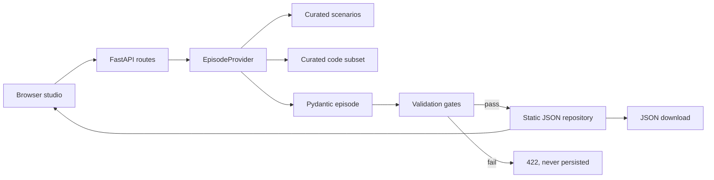

# Architecture

## Product boundary

Synthetic Episode Studio creates inspectable synthetic evaluation inputs. It does not execute a commercial coding model or score its output. This keeps the MVP focused on the upstream data problem: safe, consistent and traceable episode creation.

## Request flow

Every component accepts or returns typed models. The API never persists an episode that fails validation.

## Components

| Component | Responsibility |
|---|---|
| `models.py` | Canonical typed contract and exported JSON Schema |
| `scenarios.py` | Ten bounded clinical narrative definitions and evidence contracts |
| `references.py` | Small, versioned ICD-10/OPCS-4 subset with URLs and provenance |
| `generator.py` | Provider protocol and seeded deterministic implementation |
| `validator.py` | Cross-document and classification integrity gates |
| `repository.py` | Atomic, filename-safe static JSON persistence |
| `main.py` | HTTP routes, templating, schema lifecycle and download response |
| `templates/`, `static/` | Responsive studio and evidence-highlight interaction |

## Determinism

The provider creates a local `random.Random(seed)` instance and never uses global randomness. A scenario and seed fully determine patient labels, permitted demographics, encounter dates and narrative details. `generated_at` is derived from the encounter rather than wall-clock time, so complete JSON output is reproducible.

## Evidence contract

Documents contain uniquely identified passages. Each classification contains one or more `evidence_passage_ids`. Validation resolves those identifiers against the full document set and rejects dangling links. The browser uses the same identifiers to highlight evidence when a user selects a code.

## Safety boundaries

- Synthetic identifiers are visibly prefixed with `SYN-`.
- Display names start with `Synthetic`; no NHS number, address or real date of birth is generated.
- Track constraints keep newborn and adult demographics separated.
- Every emitted code must exist in the curated subset.
- Procedures and OPCS-4 assignments must agree.
- Non-procedural episodes explicitly explain the absence of OPCS-4 output.
- The UI and JSON carry prominent non-clinical-use notices.

These are engineering controls, not proof of anonymisation or clinical safety.

## Future OpenAI provider

`EpisodeProvider` is the integration seam. A future provider should generate candidate structured data from the contract in `prompts/openai_provider_contract.md`, validate it as an `Episode`, run the same deterministic validator, and persist only a passing result. The deterministic provider should remain available for smoke tests, demonstrations and fallbacks.

## Operational shape

The MVP deliberately has no database, authentication, background worker or runtime network dependency. This is appropriate for a local hackathon demonstration, not a deployed multi-user service. Production work would add identity, audit logging, encrypted storage, terminology distribution licensing, rate limiting, observability and a governed clinical-quality process.
